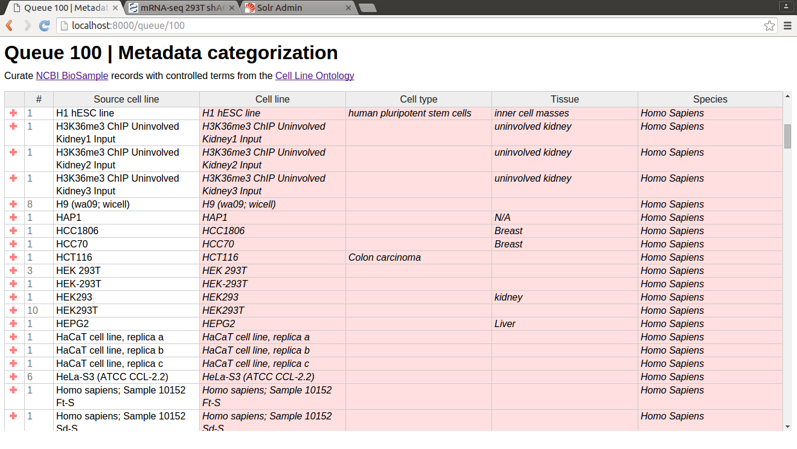
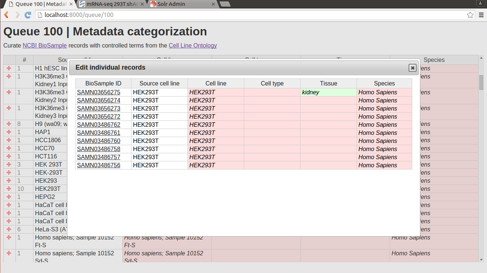
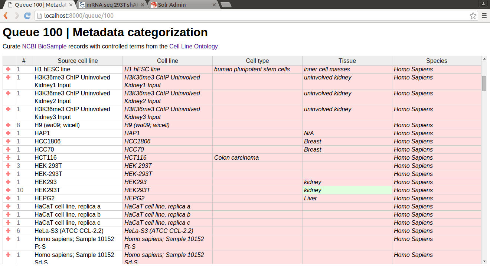
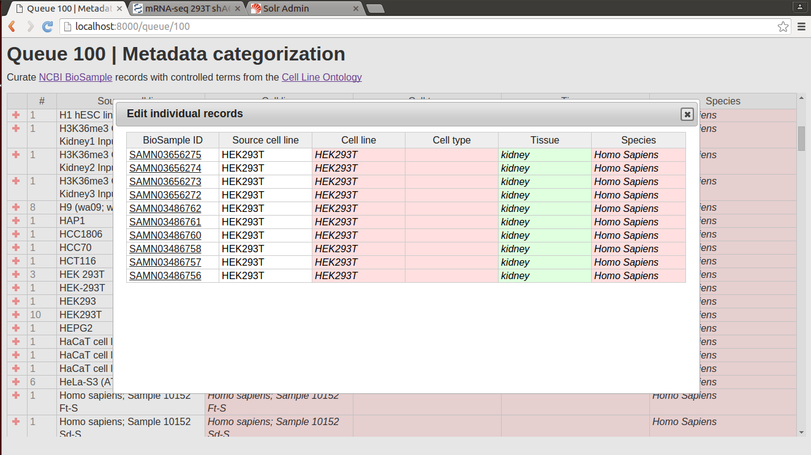

# Metadata categorization
A crowdsourcing/expert curation platform for metadata categorization

The Metadata Categorization web application allows expert biological indexers to curate a sample set drawn from [NCBI BioSample](http://www.ncbi.nlm.nih.gov/biosample) data.  The purpose of the annotation tool is to identify terms in the user submission that can be correlated to controlled terms from the [Cell Line Ontology](http://www.clo-ontology.org).  In the best case, the annotator can identify the correct cell line from submitted data and then additional information about the submitted data such as cell type, tissue, and disease can be populated from the Cell Line Ontology.

# Technology

## Solr-based Data Sources

This project depends on two [Solr](http://lucene.apache.org/solr/) cores generated for this purpose which contain the relevant data from BioSample and the Cell Line Ontology. The Solr core generated from BioSample will store the user-submitted data extracted from BioSample as well as the annotations supplied by the curators.

## Django

The back-end uses [Django](https://www.djangoproject.com/), a high-level Python web framework, to handle URL routing, aggregating individual records from BioSample into summary records, as well as reading from and writing to Solr.

## Handsontable

The front-end uses the free version of [Handsontable](https://docs.handsontable.com), an Excel-like composite spreadsheet component.  Handsontable provides built-in editing functionality for tabular data.  Dialogs and certain other features use [jQuery](https://jquery.com/) and [jQuery UI](http://jqueryui.com/).

# Future work

- [Issue 3](https://github.com/NCBI-Hackathons/Metadata_categorization/issues/3): Incorporate a recommendations feature generated from minimal text processing to provide annotators with a "best guess" at the cell line to facilitate the annotation task.
- [Issue 6](https://github.com/NCBI-Hackathons/Metadata_categorization/issues/6): Incorporate a search feature into the web interface so annotators can look up controlled terms from the Cell Line Ontology.  
- [Issue 7](https://github.com/NCBI-Hackathons/Metadata_categorization/issues/7): Add "Recently Used" shortcut buttons to the web interface so that annotators can quickly access frequently used annotation terms

# Screenshots
Summary records, showing on-the-fly aggregations of individual BioSample records that have the same source cell line value.

Individual records for "HEK293T" source cell line, shown upon clicking the "+" button at left in the HEK293T summary record.  Note the user-annotated value for "Tissue" field in green.  Unannotated (i.e. source) values are displayed in red.

Editing fields at the the summary record level propagates value to all individual records in that group

